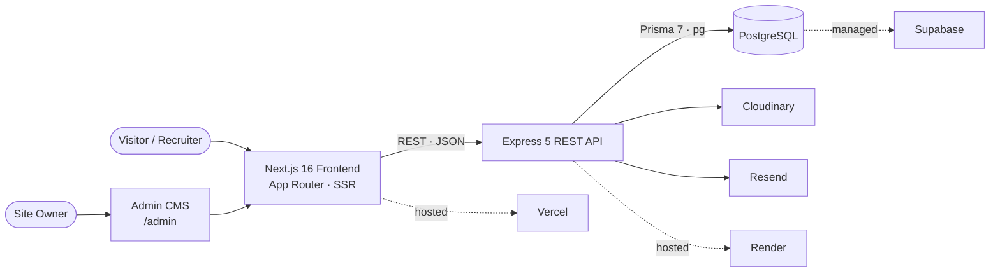
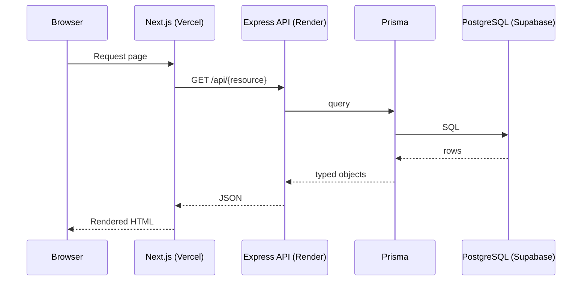
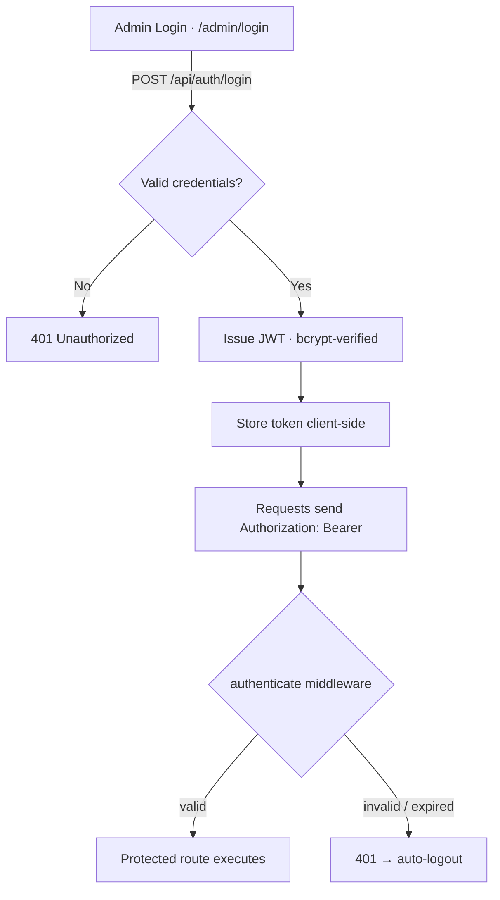
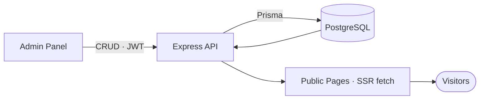
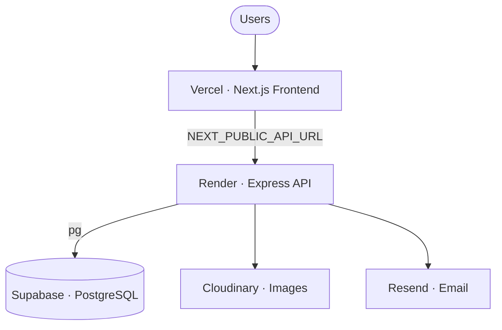

<div align="center">

<picture>
  <source media="(prefers-color-scheme: dark)" srcset="./frontend/public/branding/logo-white.png">
  <source media="(prefers-color-scheme: light)" srcset="./frontend/public/branding/logo-black.png">
  
</picture>

# Abir Barman — Portfolio Platform

### A full‑stack, CMS‑driven personal portfolio — engineered like a product, documented like a platform.

A production portfolio where **every piece of content lives in PostgreSQL** and is managed through a custom, JWT‑protected admin CMS — Next.js 16 frontend, Express 5 REST API, Prisma ORM, and a 198‑file technical documentation system.

<br/>

[](https://abirbarman.com)
[](#-documentation-hub)
[](https://app.notion.com/p/My-Portfolio-Website-392c634e2df6803e8319f52f07b608d0?source=copy_link)
[](https://github.com/abarman152/abir-portfolio/issues)
[](./LICENSE)

[](https://nextjs.org)
[](https://react.dev)
[](https://www.typescriptlang.org)
[](https://expressjs.com)
[](https://www.prisma.io)
[](https://www.postgresql.org)
[](https://tailwindcss.com)
[](#-architecture)
[](https://github.com/abarman152/abir-portfolio/commits)

<br/>

**[🚀 Live Website](https://abirbarman.com)**  ·  **[📚 Documentation](#-documentation-hub)**  ·  **[🗂️ Notion Workspace](https://app.notion.com/p/My-Portfolio-Website-392c634e2df6803e8319f52f07b608d0?source=copy_link)**  ·  **[⚡ Quick Start](#-getting-started)**  ·  **[🐛 Report Issue](https://github.com/abarman152/abir-portfolio/issues)**

</div>

---

## 🗂️ Public Notion Workspace

> **Notion is the project‑management & knowledge hub.** Where `/docs` captures *how the system works*, Notion captures *the state of the work* — planning, tracking, and decisions. The workspace is public and mirrors the real development history of this project.

<div align="center">

### [](https://app.notion.com/p/My-Portfolio-Website-392c634e2df6803e8319f52f07b608d0?source=copy_link)

</div>

**What you'll find inside:**

| | | |
|---|---|---|
| 🗺️ Project Roadmap | 🧾 Sprint Planning | 📋 Backlog & Kanban |
| 🏛️ Architecture Discussions | 🤝 Meeting Notes | 🧭 Decision Log |
| 💡 Research & Ideas | 🧱 Feature Planning | 🎨 Design Notes |
| 🚀 Release Planning | 📊 Progress Tracking | 🕒 Development Timeline |
| 📚 Learning Notes | 🐛 Bug Dashboard | 🔍 Production Audit & Reports |

```
Public Notion Workspace
https://app.notion.com/p/My-Portfolio-Website-392c634e2df6803e8319f52f07b608d0?source=copy_link
```

> Technical detail is never duplicated in Notion — each entry links back to the authoritative `/docs` file. See the split rules in [Markdown vs Notion](#-markdown-vs-notion).

---

## 📊 Project Metrics

*Computed from the repository (excludes `node_modules`, `.next`, `Archive`).*

| Metric | Count | Metric | Count |
|---|:--:|---|:--:|
| 📝 Markdown files (repo‑wide) | **281** | 🧩 Components (`.tsx`) | **20** |
| 📚 Documentation files (`/docs`) | **198** | 🧭 API route groups | **16** |
| 🗂️ Documentation categories | **35** | 🗄️ Database models (Prisma) | **18** |
| 🏛️ Architecture documents | **17** | 📦 npm dependencies (FE + BE) | **39** |
| ⭐ Feature docs | **10** | 🧾 Scripts (root + backend) | **14** |
| 🧱 Doc templates | **25** | ⚙️ Config files | **8** |
| 📄 Pages (`page.tsx`) | **26** | 🖼️ Public images / assets | **9** |

---

## 🧭 Quick Navigation

[Executive Overview](#-executive-overview) ·
[Repository Highlights](#-repository-highlights) ·
[Feature Matrix](#-feature-matrix) ·
[Technology Stack](#-technology-stack) ·
[Architecture](#-architecture) ·
[Repository Structure](#-repository-structure) ·
[Documentation Hub](#-documentation-hub) ·
[Documentation Navigation](#-documentation-navigation) ·
[Markdown vs Notion](#-markdown-vs-notion) ·
[Getting Started](#-getting-started) ·
[Deployment](#-deployment) ·
[Scripts](#-scripts-reference) ·
[Contributing](#-contributing) ·
[License](#-license)

---

## 📌 Executive Overview

**Why this project exists.** A résumé and a static site tell you what someone *claims*. This repository is the opposite: a real full‑stack product that demonstrates architecture, documentation discipline, and operational maturity — the actual skills — while doubling as the owner's public portfolio. It is built so a recruiter, client, or engineer can evaluate the work honestly, at a glance, and in depth.

| | |
|---|---|
| **Purpose** | Present projects, research, certifications, achievements, and skills through a fast, accessible, fully self‑managed website. |
| **Vision** | A portfolio that works as hard as the engineer behind it — fast, accessible, honestly documented, and evaluable at a glance. |
| **Business goals** | Ship & maintain a full‑stack site with a complete CMS; keep documentation drift‑free; hold a premium, Apple‑inspired design bar; close the highest‑value security & performance gaps. |
| **Target audience** | Recruiters & clients (public site) · the site owner (admin CMS) · engineers evaluating the code and docs. |
| **Business value** | Single source of truth in the database; zero‑code content updates; enterprise‑grade documentation that makes the codebase transferable and auditable. |
| **Key capabilities** | Database‑driven CMS, admin dashboard, resume system with embeddable preview, contact‑to‑email flow, dark/light theming, SEO, responsive & accessible UI. |

---

## ✨ Repository Highlights

| | Highlight | Grounded in |
|---|---|---|
| 📚 | **Enterprise Documentation** | 198 files across 35 categories under [`/docs`](./docs/README.md), audited against the real code |
| 🛠️ | **Content Management System** | Custom, no‑headless CMS — full CRUD over 18 models |
| 📊 | **Admin Dashboard** | Aggregated content management at `/admin` |
| 🗂️ | **Portfolio Showcase** | Projects, skills, stats, social — all DB‑driven |
| 🔬 | **Research Management** | Dedicated research model + case‑study detail routes |
| 🎓 | **Certifications & Achievements** | First‑class content types with featured/visibility toggles |
| 📄 | **Resume Management** | Centralized resume + independent embeddable `/resume` preview |
| 🔍 | **SEO Optimization** | SSR, dynamic `sitemap.ts` / `robots.ts`, per‑page metadata |
| ⚡ | **Performance Optimization** | SSR + fetch revalidation, code splitting, Cloudinary transforms |
| ♿ | **Accessibility** | WCAG 2.2‑oriented; reduced‑motion, labeled controls, live regions |
| 🔐 | **Authentication & Security** | JWT + bcrypt, rate limiting, CORS allow‑listing, env fail‑fast |
| 📱 | **Responsive Design** | Mobile‑first, fluid across all breakpoints |

---

## 🧮 Feature Matrix

| Module | Status | Backed by |
|---|:--:|---|
| Portfolio / Projects | ✅ | `Project` model · `/projects/[slug]` · `projects` route |
| Admin Dashboard | ✅ | `/admin` · `dashboard` route |
| Content Management System | ✅ | 18 Prisma models · admin CRUD · JWT |
| Research Publications | ✅ | `Research` model · `/research/[slug]` |
| Certifications | ✅ | `Certification` model · `/certifications/[slug]` |
| Achievements | ✅ | `Achievement` model · `/achievements/[slug]` |
| Resume System | ✅ | `HeroContent.resumeUrl` + `resumePreviewUrl` · `/resume` |
| Skills & Stats | ✅ | `SkillCategory` / `Skill` / `Stat` models |
| About Profile | ✅ | `AboutProfile` · `Education` · `AboutSection` |
| Contact + Email | ✅ | `ContactMessage` model · Resend notifications |
| Theming (Dark/Light) | ✅ | `SiteSettings` · CSS token system |
| SEO | ✅ | `sitemap.ts` · `robots.ts` · metadata |
| Authentication | ✅ | JWT · bcrypt · `authenticate` middleware |
| Responsive Design | ✅ | Tailwind 4 · mobile‑first layouts |

---

## 🧰 Technology Stack

*Only technologies actually present in `frontend/package.json`, `backend/package.json`, and the deploy configuration.*

### Frontend
| Technology | Role |
|---|---|
| **Next.js 16** (App Router) | SSR/SSG, routing, server & client components |
| **React 19** | UI runtime |
| **TypeScript 5** | End‑to‑end type safety |
| **Tailwind CSS 4** | Utility styling + CSS custom‑property design tokens |
| **Framer Motion 12** | Purposeful, reduced‑motion‑aware animation |
| **lucide-react** | Icon system |
| **react-markdown + remark-gfm** | Markdown rendering for case studies |

### Backend
| Technology | Role |
|---|---|
| **Node.js ≥ 20.19** (v22 recommended) | Runtime |
| **Express 5** | REST API framework |
| **TypeScript 5 · tsx** | Typed server + hot‑reload dev |
| **express-validator** | Request validation |
| **express-rate-limit** | Abuse protection (auth/contact) |
| **multer** | Upload handling |

### Database
| Technology | Role |
|---|---|
| **PostgreSQL** | Relational database (18 models) |
| **Prisma ORM 7** | Schema, sync (`db push`), typed client |
| **@prisma/adapter-pg** | `pg`‑driver adapter |

### Cloud · Infrastructure · Deployment
| Service | Role |
|---|---|
| **Vercel** | Frontend hosting |
| **Render** | Backend API hosting |
| **Supabase** | Managed PostgreSQL (production) |
| **Cloudinary** | Image storage & transformations |
| **Resend** | Transactional email |

### Auth · AI Dev Tools · Documentation
| Area | Details |
|---|---|
| **Authentication** | jsonwebtoken (JWT) · bcryptjs |
| **AI development tools** | Claude Code / Agent SDK driven by [`AGENTS.md`](./frontend/AGENTS.md) |
| **Tooling** | ESLint 9 · Prisma CLI/Studio · dotenv |
| **Documentation** | 198 Markdown files under [`/docs`](./docs/README.md) · Notion for PM |

---

## 🏗️ Architecture

A strictly layered monorepo — the frontend is presentation‑only, the backend owns all logic and data access, and the database is the single source of truth.

### High‑level architecture



### Request / data flow



### Authentication flow (admin)



### Admin CMS content flow



Deep dives: [`architecture/overview.md`](./docs/architecture/overview.md) · [`rendering-strategy.md`](./docs/architecture/rendering-strategy.md) · [`authentication-flow.md`](./docs/architecture/authentication-flow.md) · [`deployment-architecture.md`](./docs/architecture/deployment-architecture.md).

---

## 🗂️ Repository Structure

```
abir-portfolio/
├── frontend/                    # Next.js 16 app — presentation layer
│   ├── src/
│   │   ├── app/                 # App Router routes (home, about, projects, research,
│   │   │   │                    #   certifications, achievements, resume, admin/)
│   │   │   ├── admin/           # Protected admin CMS (login + CRUD dashboards)
│   │   │   ├── layout.tsx       # Root layout, metadata, theming
│   │   │   ├── sitemap.ts       # Dynamic SEO sitemap
│   │   │   └── robots.ts        # Crawler directives
│   │   ├── components/          # sections/ · admin/ · ui/  (20 components)
│   │   └── lib/                 # api.ts (fetch client) · types.ts · resume.ts
│   ├── public/branding/         # logo-black.png · logo-white.png (brand identity)
│   └── AGENTS.md                # Engineering rulebook (rules, design system)
│
├── backend/                     # Express 5 REST API — logic & data layer
│   ├── src/
│   │   ├── index.ts             # Bootstrap · CORS · route mounting · error handler
│   │   ├── routes/              # 16 resource routers (hero, projects, research, ...)
│   │   ├── middleware/          # JWT authentication
│   │   ├── lib/                 # Prisma client · Resend notifications
│   │   └── seed.ts              # Idempotent database seed
│   └── prisma/schema.prisma     # 18 models — single source of truth
│
├── docs/                        # 198‑file technical documentation system
├── package.json                 # Monorepo scripts (dev / build / db)
├── CHANGELOG.md · CONTRIBUTING.md · CODE_OF_CONDUCT.md · SECURITY.md · LICENSE
```

| Folder | Purpose & responsibility | Important files |
|---|---|---|
| [`frontend/`](./frontend) | Presentation only — pages, sections, admin UI, fetch client. Never imports Prisma. | `src/app/`, `src/lib/api.ts`, `AGENTS.md` |
| [`backend/`](./backend) | All business logic, validation, auth, and DB access. | `src/index.ts`, `src/routes/`, `src/middleware/` |
| [`backend/prisma/`](./backend/prisma) | Canonical content shape — 18 Prisma models. | `schema.prisma` |
| [`docs/`](./docs) | Versioned technical documentation — architecture → operations. | `README.md` (index) |
| [`frontend/public/branding/`](./frontend/public/branding) | Brand assets used across the site and this README. | `logo-black.png`, `logo-white.png` |

---

## 📚 Documentation Hub

This README is the **canonical entry point**; the full technical documentation lives in [`/docs`](./docs/README.md), versioned with the code and audited against the real repository.

### Getting Started
| Doc | Purpose | Location |
|---|---|---|
| Setup & Workflow | Local install, env, run, common tasks | [`docs/development/setup-and-workflow.md`](./docs/development/setup-and-workflow.md) |
| Coding Standards | Conventions & code style | [`docs/development/coding-standards.md`](./docs/development/coding-standards.md) |
| Git Workflow | Branching & commit conventions | [`docs/development/git-workflow.md`](./docs/development/git-workflow.md) |
| Troubleshooting | Fixes for common local issues | [`docs/development/troubleshooting.md`](./docs/development/troubleshooting.md) |

### Architecture · Frontend · Backend · Database · API
| Doc | Purpose | Location |
|---|---|---|
| System Overview | Design & layer boundaries | [`docs/architecture/overview.md`](./docs/architecture/overview.md) |
| Rendering Strategy | SSR/SSG/CSR per route | [`docs/architecture/rendering-strategy.md`](./docs/architecture/rendering-strategy.md) |
| Frontend Guide | Structure & conventions | [`docs/frontend/README.md`](./docs/frontend/README.md) |
| Backend Guide | Structure & conventions | [`docs/backend/README.md`](./docs/backend/README.md) |
| Database Schema | All 18 Prisma models | [`docs/database/schema-reference.md`](./docs/database/schema-reference.md) |
| REST API Reference | Every endpoint | [`docs/api/rest-api-reference.md`](./docs/api/rest-api-reference.md) |

### Features · Research · Resume · CMS
| Doc | Purpose | Location |
|---|---|---|
| Features Index | All product features | [`docs/features/README.md`](./docs/features/README.md) |
| Resume System | Centralized resume + preview | [`docs/features/resume-system.md`](./docs/features/resume-system.md) · [`resume-preview.md`](./docs/features/resume-preview.md) |
| Admin / CMS | Managing content | [`docs/cms/admin-panel-reference.md`](./docs/cms/admin-panel-reference.md) |
| Notification System | Contact → Resend email | [`docs/features/notification-system.md`](./docs/features/notification-system.md) |

### Deployment · Security · Performance · Testing
| Doc | Purpose | Location |
|---|---|---|
| Deployment | Hosting, CI/CD, rollback | [`docs/deployment/hosting-guide.md`](./docs/deployment/hosting-guide.md) |
| Environment Variables | Full env matrix | [`docs/deployment/environment-variables.md`](./docs/deployment/environment-variables.md) |
| Security | Auth, secrets, CORS, OWASP | [`docs/security/`](./docs/security/) |
| Performance | Core Web Vitals, images | [`docs/performance/`](./docs/performance/) |
| Testing | Strategy & manual QA | [`docs/testing/strategy.md`](./docs/testing/strategy.md) |

### Operations · Reference · Standards · Templates
| Doc | Purpose | Location |
|---|---|---|
| Known Issues | Open, accepted issues | [`docs/known-issues.md`](./docs/known-issues.md) |
| Technical Debt | Deferred items & payoff | [`docs/technical-debt.md`](./docs/technical-debt.md) |
| Debug Reports | Root‑cause investigations | [`docs/debug/`](./docs/debug/) |
| Standards | Style, versioning, review | [`docs/standards/`](./docs/standards/) |
| Templates | Reusable doc templates | [`docs/templates/`](./docs/templates/) |
| Full Documentation Index | The complete map | [`docs/README.md`](./docs/README.md) |

---

## 🌳 Documentation Navigation

```
README.md  (canonical entry point)
│
├── Getting Started ......... docs/development/setup-and-workflow.md
├── Documentation
│   ├── Architecture ....... docs/architecture/
│   ├── Backend ............ docs/backend/README.md
│   ├── Frontend ........... docs/frontend/README.md
│   ├── Database ........... docs/database/schema-reference.md
│   ├── API ................ docs/api/rest-api-reference.md
│   ├── Deployment ......... docs/deployment/hosting-guide.md
│   ├── Security ........... docs/security/
│   ├── Performance ........ docs/performance/
│   ├── Features ........... docs/features/README.md
│   ├── Operations ......... docs/known-issues.md · docs/technical-debt.md · docs/debug/
│   └── Reference .......... docs/references/ · docs/glossary/ · docs/adr/
│
├── Public Notion .......... project management workspace (link above)
└── Contribution ........... CONTRIBUTING.md · docs/standards/
```

---

## 🔀 Markdown vs Notion

Two systems of record, each with one clear responsibility. Defined in full at [`docs/notion-vs-markdown.md`](./docs/notion-vs-markdown.md).

| | **Markdown (`/docs`)** | **Notion** |
|---|---|---|
| **Owns** | How the system *works* | The *state of the work* |
| **Content** | Architecture, API, deployment, security, developer guides, reference | Roadmaps, sprint planning, Kanban, meeting notes, ideas, research, progress, decision log |
| **Source of truth** | ✅ Authoritative for all technical detail | Thin summaries + links back to `/docs` |
| **Versioning** | Git history (per commit) | Notion page history |
| **Ownership / review** | PR‑reviewed with the code | Working space, edited directly |
| **Sync rule** | — | When a "both" item changes on the git side, update the Notion pointer in the same session; **no automated two‑way sync** |

**Single source of truth:** every fact has exactly one authoritative home — the git doc. Notion never re‑describes a system; it points to it.

---

## ⚡ Getting Started

**Requirements:** Node.js ≥ 20.19 (v22 recommended) · PostgreSQL · npm. Cloudinary & Resend accounts are optional (image uploads / contact emails).

```bash
# 1 — Clone
git clone https://github.com/abarman152/abir-portfolio.git
cd abir-portfolio

# 2 — Install frontend + backend
npm run install:all

# 3 — Configure environment
cp backend/.env.example backend/.env
#   backend/.env         → DATABASE_URL, JWT_SECRET, PORT, FRONTEND_URL (+ Cloudinary, Resend)
#   frontend/.env.local  → NEXT_PUBLIC_API_URL=http://localhost:5002/api

# 4 — Sync schema + seed content
npm run db:push
npm run db:seed

# 5 — Run (two terminals)
npm run dev:backend      # API → http://localhost:5002
npm run dev:frontend     # App → http://localhost:3000

# Build the frontend for production
npm run build:frontend
```

> **Local note:** the backend defaults to port **5002** (5001 is contended on some macOS setups); keep `NEXT_PUBLIC_API_URL` aligned. Full env matrix: [`docs/deployment/environment-variables.md`](./docs/deployment/environment-variables.md) · troubleshooting: [`docs/development/troubleshooting.md`](./docs/development/troubleshooting.md).

---

## 🚀 Deployment



| Layer | Platform | Notes |
|---|---|---|
| Frontend | **Vercel** | Next.js 16, auto‑deploy from `main` |
| Backend | **Render** | Express API; `start` runs schema sync → seed → serve |
| Database | **Supabase** | Managed PostgreSQL |
| Images | **Cloudinary** | `f_auto,q_auto` transformations |
| Email | **Resend** | Contact‑form notifications |

Runbook: [`docs/deployment/hosting-guide.md`](./docs/deployment/hosting-guide.md) · environments: [`docs/deployment/environments.md`](./docs/deployment/environments.md) · rollback & monitoring: [`docs/deployment/rollback-monitoring-logging.md`](./docs/deployment/rollback-monitoring-logging.md).

---

## 🧾 Scripts Reference

Run from the repository root:

| Script | Action |
|---|---|
| `npm run install:all` | Install frontend + backend dependencies |
| `npm run dev:frontend` | Start the Next.js app (`localhost:3000`) |
| `npm run dev:backend` | Start the Express API (`localhost:5002`) |
| `npm run build:frontend` | Production build of the frontend |
| `npm run db:push` | Sync the Prisma schema to the database |
| `npm run db:seed` | Seed initial content (idempotent) |
| `npm run db:studio` | Open Prisma Studio (visual DB browser) |

---

## 🤝 Contributing

| Area | Convention |
|---|---|
| **Git workflow** | Feature branches off `main`; open a PR for review. See [`docs/development/git-workflow.md`](./docs/development/git-workflow.md). |
| **Branch naming** | `feat/…`, `fix/…`, `docs/…`, `chore/…` |
| **Commits** | Conventional Commits (`feat:`, `fix:`, `docs:`, `refactor:`) |
| **PR checklist** | Typecheck clean · lint at baseline · docs updated in the same PR · no hardcoded content |
| **Documentation standards** | Follow [`docs/standards/`](./docs/standards/) — style guide, versioning, review process |
| **Review process** | Markdown docs are reviewed like code; see [`docs/standards/review-and-maintenance-process.md`](./docs/standards/review-and-maintenance-process.md) |

Full engineering rulebook: [`frontend/AGENTS.md`](./frontend/AGENTS.md). Policy: [`CONTRIBUTING.md`](./CONTRIBUTING.md) · [`CODE_OF_CONDUCT.md`](./CODE_OF_CONDUCT.md) · [`SECURITY.md`](./SECURITY.md).

---

## 📄 License

Released under the **MIT License** — see [`LICENSE`](./LICENSE).

<div align="center">
<br/>

<picture>
  <source media="(prefers-color-scheme: dark)" srcset="./frontend/public/branding/logo-white.png">
  <source media="(prefers-color-scheme: light)" srcset="./frontend/public/branding/logo-black.png">
  
</picture>

**Built by [Abir Barman](https://abirbarman.com)** — Data Scientist & Full‑Stack Developer

[](https://abirbarman.com)
[](./docs/README.md)
[](https://app.notion.com/p/My-Portfolio-Website-392c634e2df6803e8319f52f07b608d0?source=copy_link)

</div>
