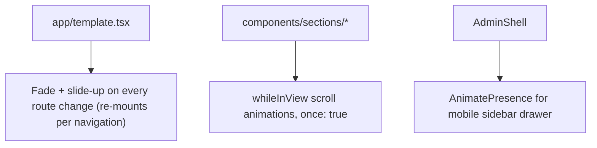

# Animation Architecture

## Scope
How Framer Motion is used across the site, and the principles that govern it. See [`../design-system/tokens-and-guidelines.md`](../design-system/tokens-and-guidelines.md) for the full timing/easing rulebook this architecture follows.

## Where animation lives

- **`template.tsx`** (not a layout) wraps every page and re-mounts on each navigation, running a fade/slide-up transition. This is why it's a template and not a layout — layouts persist across navigations, templates don't, which is exactly the remount behavior a page-transition effect needs.
- **Section components** use Framer Motion's `whileInView` with `once: true` for scroll-triggered entrance animations, staggering children at a max `0.08s` interval.
- **`AdminShell`** uses `AnimatePresence` for the mobile sidebar drawer's slide-in/out and backdrop fade.

## Principles (enforced by convention, not by tooling)

- Animations are purposeful (feedback/attention), never decorative bounce/elastic easing.
- Respects `prefers-reduced-motion` per the design system rules.
- Timing caps: hover 150–200ms, state transitions 200–300ms, entry 300–500ms; never chain past 800ms total.
- No spinning loaders on content (skeletons instead), no parallax, no auto-playing carousels.

## Dead dependency note

`@react-three/fiber`, `@react-three/drei`, and `three` are present in `frontend/package.json` and README's tech stack table, but **zero components import them** — there is no 3D animation anywhere in the actual app. Framer Motion is the entire real animation stack. See [`../appendices/technical-debt-register.md`](../appendices/technical-debt-register.md) item #6.

## Related
- [`../design-system/tokens-and-guidelines.md`](../design-system/tokens-and-guidelines.md)
- [`component-hierarchy.md`](./component-hierarchy.md)
