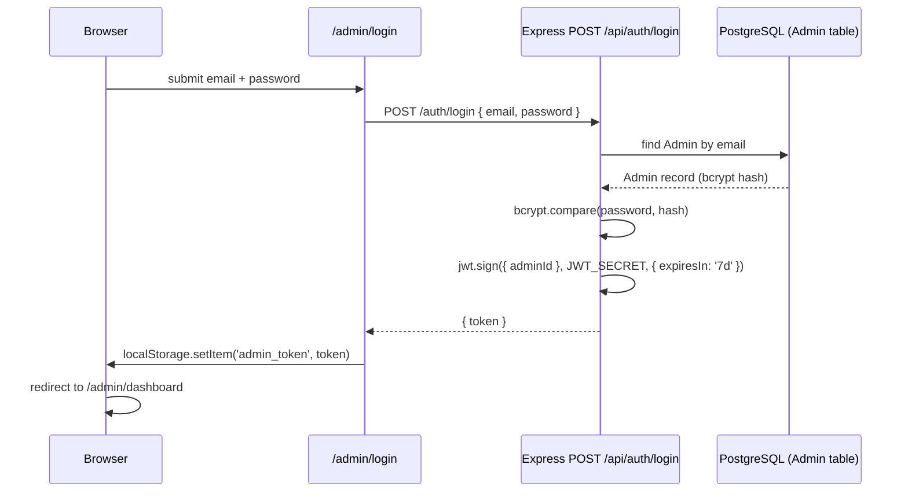

# Authentication Flow

## Scope
The admin login flow, token verification, and — importantly — where route protection does and does not happen.

## Login sequence



## Subsequent authenticated requests

```mermaid
sequenceDiagram
    participant AdminUI as Any /admin/* page
    participant API as Express route
    participant MW as authenticate middleware
    AdminUI->>API: request with Authorization: Bearer <token>
    API->>MW: authenticate(req, res, next)
    MW->>MW: jwt.verify(token, JWT_SECRET)
    alt valid
        MW-->>API: req.adminId = decoded.adminId; next()
        API-->>AdminUI: 200 + data
    else invalid/expired
        MW-->>AdminUI: 401
    end
```

## Where the guard actually lives — read this carefully

**There is no `middleware.ts` in the frontend.** `app/admin/layout.tsx` only sets page metadata — it performs no auth check. The actual client-side guard is a `useEffect` inside `AdminShell.tsx`:

```ts
useEffect(() => {
  const token = localStorage.getItem('admin_token');
  if (!token) router.replace('/admin/login');
  setMounted(true);
}, [router]);
```

**Practical consequence:** an unauthenticated visitor's browser receives the admin page shell's initial render before the client-side redirect fires. This is not a data leak — every actual data fetch is independently JWT-gated server-side via the `authenticate` middleware above — but it does mean the admin UI shell itself is not access-controlled at the edge. See [`../security/authentication.md`](../security/authentication.md) for the full risk discussion and [`../appendices/technical-debt-register.md`](../appendices/technical-debt-register.md) item #13.

## Token storage tradeoff

The JWT lives in `localStorage`, not an httpOnly cookie. This is a deliberate-by-default (not actively decided) architecture point with real security tradeoffs — see [`future-architecture.md`](./future-architecture.md) and [`../appendices/technical-debt-register.md`](../appendices/technical-debt-register.md) item #14 for the cookie+CSRF alternative that would need to be adopted together, not the cookie change alone.

## Related
- [`../security/authentication.md`](../security/authentication.md)
- [`../cms/admin-panel-reference.md`](../cms/admin-panel-reference.md)
- [`future-architecture.md`](./future-architecture.md)
