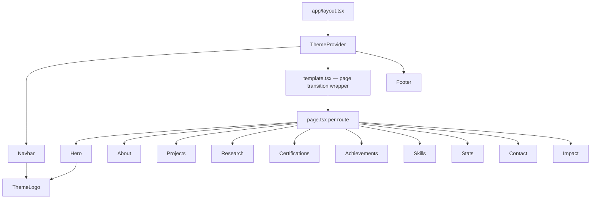
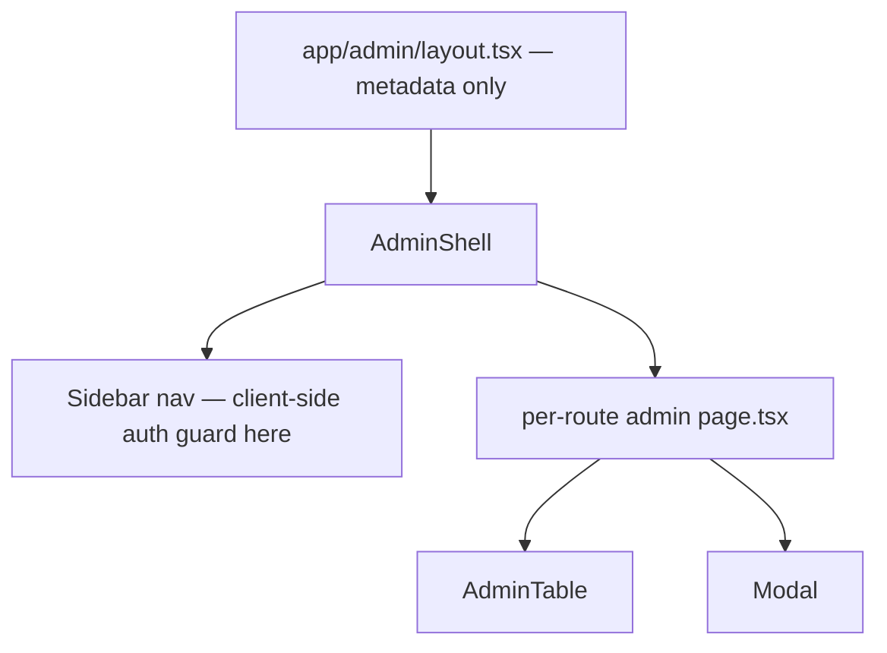

# Component Hierarchy

## Scope
How components compose on the public site and in the admin panel. Per-component detail lives in [`../components/`](../components/).

## Public site composition

Home page (`/`) is the only route composing most section components together; other routes (`/about`, `/projects`, etc.) render a single dedicated section/list component per route.

## Admin panel composition

`AdminShell` is the single composition point for every admin route — it's where the sidebar, theme toggle, logout, and (critically) the `localStorage` auth check all live. See [`authentication-flow.md`](./authentication-flow.md).

## Composition principles observed in the code

- **Section components are self-contained data consumers**, not purely presentational — most fetch or receive already-fetched data and format prices/dates/markdown internally rather than through shared render-prop patterns.
- **No component composition library** (no Radix/shadcn primitives) — `ui/PaperCard.tsx` is the only shared primitive; everything else is bespoke per section.
- **`ThemeLogo` is reused** in both `Navbar` and `AdminShell`, making it the one component genuinely shared across the public/admin boundary.

## Related
- [`../components/`](../components/) — per-component docs
- [`theme-architecture.md`](./theme-architecture.md)
- [`animation-architecture.md`](./animation-architecture.md)
