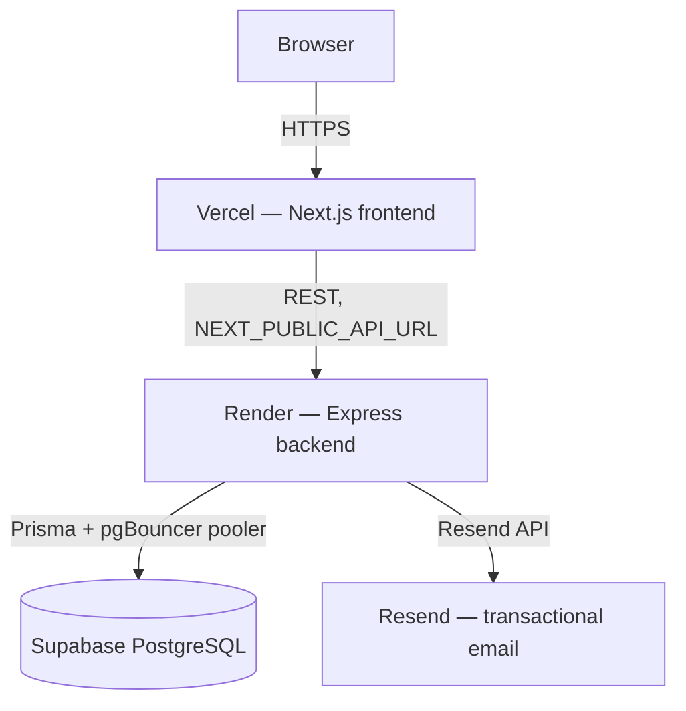

# Deployment Architecture

## Scope
Production topology. Step-by-step deploy instructions live in [`../deployment/hosting-guide.md`](../deployment/hosting-guide.md) — this doc covers the shape, not the how-to.

## Topology

## Key facts

- **Split deployment, not a single monorepo deploy.** Frontend and backend deploy independently to different providers, each auto-deploying on push to `main` via their own GitHub integration (no shared CI pipeline).
- **No IaC.** No `render.yaml`, no Dockerfile, no `docker-compose.yml`, no `.github/workflows/`. Both deploy configs (build/start commands, env vars) live only in each platform's dashboard — not reproducible from the repo alone. This is a real gap if the project ever needs disaster recovery or a second environment.
- **Database connection pooling**: `DATABASE_URL` uses Supabase's transaction pooler (port 6543, pgBouncer) for runtime queries; `DIRECT_URL` (port 5432) is used only for schema push/migrations, which pgBouncer's transaction mode doesn't support.
- **Media is not a deployed service** — despite being drawn as part of some earlier docs' stack diagrams, there is no Cloudinary integration in code; images are external URLs the browser fetches directly. See [`overview.md`](./overview.md).
- **Cold starts**: Render's free tier spins down on inactivity. `sitemap.ts` and the homepage's data fetches use `AbortSignal.timeout()` with graceful fallbacks specifically to survive this (see commit `10391af`).

## Known risk in the boot sequence

`backend/package.json`'s `start` script is `npx prisma db push && node dist/seed.js && node dist/index.js` — it pushes schema and reseeds on **every** production boot, not just first deploy. This is convenient for a solo project but is not how you'd want a real production deployment to behave once real user data exists — see [`../appendices/technical-debt-register.md`](../appendices/technical-debt-register.md) item #15 and [`future-architecture.md`](./future-architecture.md).

## Related
- [`../deployment/hosting-guide.md`](../deployment/hosting-guide.md)
- [`../deployment/environment-variables.md`](../deployment/environment-variables.md)
- [`future-architecture.md`](./future-architecture.md)
