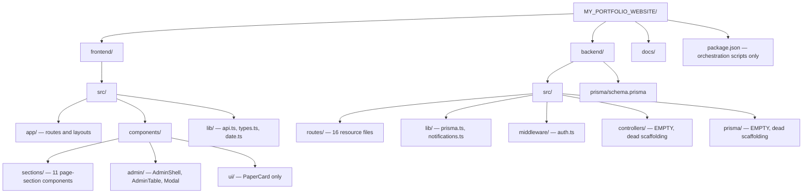

# Folder Architecture

## Scope
Annotated folder structure for both workspaces. See [`overview.md`](./overview.md) for the layer-boundary rules this structure enforces.

## Frontend (`frontend/src/`)

| Path | Purpose |
|---|---|
| `app/` | Next.js App Router — every route, layout, and special file (`robots.ts`, `sitemap.ts`, `template.tsx`) |
| `components/sections/` | Full-page section components rendered by public pages (Hero, About, Projects, etc.) |
| `components/admin/` | Admin-only shell/table/modal components |
| `components/ui/` | Reusable design-system primitives — currently just `PaperCard.tsx`; see debt item in [`appendices/technical-debt-register.md`](../appendices/technical-debt-register.md) |
| `lib/` | Cross-cutting utilities: typed API client, shared types, date formatting |

**Notably absent:** `hooks/`, `constants/`, `config/`. See [`hooks/README.md`](../hooks/README.md) and [`appendices/technical-debt-register.md`](../appendices/technical-debt-register.md) items #9 and #10.

## Backend (`backend/src/`)

| Path | Purpose |
|---|---|
| `routes/` | One file per resource; owns all business logic and query construction (no separate controller/service layer despite empty `controllers/` scaffolding existing) |
| `lib/` | `prisma.ts` (client singleton), `notifications.ts` (Resend email) |
| `middleware/` | `auth.ts` — JWT verification |
| `controllers/`, `prisma/` | **Empty directories.** Leftover scaffolding from an earlier intended layering that was never used. Candidates for deletion — see [`appendices/technical-debt-register.md`](../appendices/technical-debt-register.md). |

## Why routes own the logic directly

`frontend/AGENTS.md` originally described a thinner "routes define paths, controllers hold logic" split, but that never materialized — every route file both defines the path and contains the Prisma query logic inline. This is documented as the **actual** convention now (not the aspirational one) — see [`appendices/technical-debt-register.md`](../appendices/technical-debt-register.md) item #2 for the related response-envelope discrepancy this same drift produced.

## Related
- [`overview.md`](./overview.md) — layer boundaries these folders enforce
- [`routing-architecture.md`](./routing-architecture.md) — the `app/` tree in full detail
- [`../hooks/README.md`](../hooks/README.md) — the missing hooks layer
