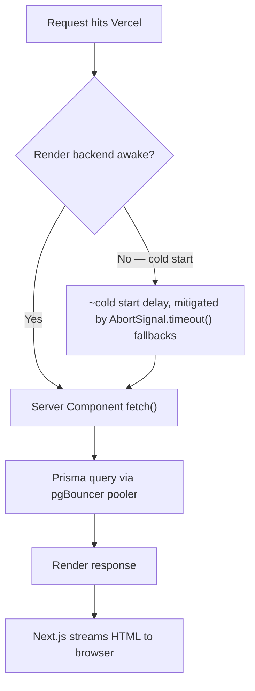

# Performance Architecture

## Scope
Architecture-level performance characteristics. Concrete optimization practices/checklists live in [`../performance/`](../performance/) — this doc explains *why* the current shape behaves the way it does.

## Where time goes on a cold request

## Architecture-level performance facts

- **No caching layer between Next.js and the database.** Every SSR request is a live fetch to Express, which is a live Prisma query. There's no Redis/edge-cache/ISR tier. This is simple and always-correct, at the cost of latency and DB load scaling linearly with traffic — acceptable at portfolio-site traffic levels, a real constraint if traffic ever grows significantly.
- **Homepage does the most work**: it composes nearly every section, and (per [`rendering-strategy.md`](./rendering-strategy.md)) double-fetches part of that data — once server-side, once client-side. This is the single biggest architectural performance issue in the app.
- **No code-splitting via `next/dynamic`** anywhere in the codebase, despite shipping unused heavy dependencies (`three`, `@react-three/fiber`, `@react-three/drei`) that inflate the client bundle for no runtime benefit. Removing those dependencies (not lazy-loading them) is the correct fix here — see [`../appendices/technical-debt-register.md`](../appendices/technical-debt-register.md) item #6.
- **Images** go through `next/image`, which handles responsive sizing/format negotiation regardless of whether the source is a real Cloudinary URL or any other HTTPS host — this is one place where the permissive `remotePatterns: **` config actually pays off architecturally (no allowlist maintenance needed as new image hosts are used).

## Related
- [`../performance/`](../performance/) — concrete optimization checklist
- [`rendering-strategy.md`](./rendering-strategy.md)
- [`deployment-architecture.md`](./deployment-architecture.md) — cold start context
