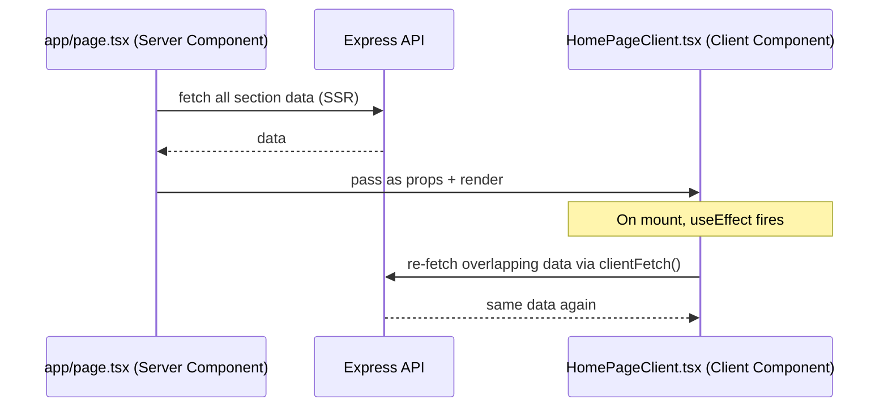

# Rendering Strategy

## Scope
How each page renders, and the one known inefficiency in this strategy (homepage double-fetch).

## Strategy table

| Page | Strategy | Revalidation |
|---|---|---|
| Home (`/`) | Server Component (SSR), then re-fetches client-side | Per-request (server) + on mount (client) |
| About, Projects, Research, Certifications, Achievements (list + detail) | Server Component (SSR) | Per-request |
| Site settings (theme, meta) | Server Component | `revalidate: 300` (5 min) |
| `sitemap.ts` | Server-generated, dynamic | `revalidate: 3600` (1 hr), 5s fetch timeout with graceful empty-array fallback |
| Admin panel (all routes) | Client Components | On-demand, `useEffect`-driven fetch |

## The homepage double-fetch

This is a real, confirmed inefficiency (tracked as [technical debt item #11](../appendices/technical-debt-register.md)) — not a deliberate strategy. The fix is to pass server-fetched data through as the client's initial state instead of re-fetching. No other page in the app does this; it's specific to `HomePageClient.tsx`.

## Why SSR-per-request instead of static generation or ISR

All content is database-backed and admin-editable at any time (see [`cms-flow.md`](./cms-flow.md)) — static generation would require on-demand revalidation wiring (e.g. a webhook from the admin save action to `revalidatePath`) that does not currently exist. Per-request SSR is simpler and correct by default, at the cost of not caching. `SiteSettings`' 5-minute revalidation window is the one exception, chosen because theme/meta config changes far less often than content.

## Related
- [`../performance/`](../performance/) for the performance implications
- [`../appendices/technical-debt-register.md`](../appendices/technical-debt-register.md) item #11
