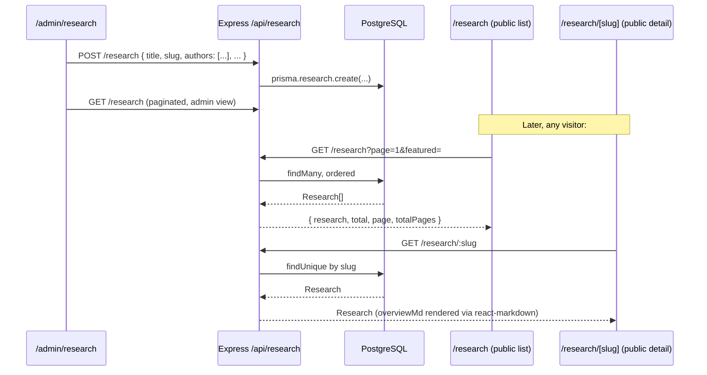

# Research Management Flow

## Scope
The Research content type traced end-to-end, as a concrete worked example of the general [CMS flow](./cms-flow.md). Research was chosen because it has the richest field set (authors as JSON, publication metadata) of any content type.

## Data model

`Research` (see [`../database/schema-reference.md`](../database/schema-reference.md)): `slug`, `title`, `abstract`, `overviewMd`, `authors` (JSON array of `{ name, role?, isPrimary? }`), `publishedAt`, `publisher`, `publicationUrl`, `googleScholarUrl`, `tags`, `featured`, `order`.

## Flow

## Notable behavior

- `authors` is stored as a raw JSON blob rather than a normalized `Author` table with a join — appropriate here since authors are a small, page-specific list rather than a reusable entity referenced elsewhere.
- The detail page renders `overviewMd` through the same Markdown pipeline used by Projects, Certifications, and Achievements (`react-markdown` + `remark-gfm`) — see [`cms-flow.md`](./cms-flow.md) for the shared rendering convention.
- `featured` and `order` control the homepage's Research section subset independently from the full `/research` listing page's pagination.

## Related
- [`cms-flow.md`](./cms-flow.md) — the general pattern this instantiates
- [`../pages/research.md`](../pages/research.md), [`../pages/research-detail.md`](../pages/research-detail.md)
- [`../api/rest-api-reference.md`](../api/rest-api-reference.md) — full `/api/research` reference
