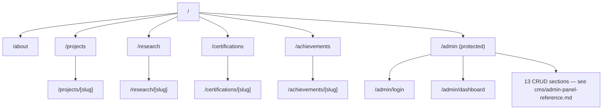

# Routing Architecture

## Scope
How requests map to pages in the Next.js App Router, and the actual (not documented-but-absent) route structure.

## Route table

Full per-route documentation lives in [`../pages/`](../pages/) — this doc covers the routing *mechanism*, not each page's content.

## Key facts

- **No route groups.** `frontend/AGENTS.md` originally described an `app/(public)/` route group; it does not exist. All routes are flat directly under `app/`. If grouping is introduced later, this doc and `AGENTS.md` both need updating in the same PR.
- **No `middleware.ts`.** There is no edge-level routing logic anywhere in the frontend. Admin route protection happens entirely client-side (see [`authentication-flow.md`](./authentication-flow.md)).
- **Special App Router files in use:** `robots.ts`, `sitemap.ts` (dynamic, fetches live slugs), `template.tsx` (page-transition animation wrapper, re-mounts on every navigation — see [`animation-architecture.md`](./animation-architecture.md)), root `layout.tsx`, `admin/layout.tsx`.
- **Dynamic segments** (`[slug]`) exist on all four content types with detail pages: projects, research, certifications, achievements. Skills, stats, hero, and social links have no detail pages — they're list-only content rendered inline on their parent page.

## Related
- [`folder-architecture.md`](./folder-architecture.md)
- [`rendering-strategy.md`](./rendering-strategy.md)
- [`authentication-flow.md`](./authentication-flow.md)
- [`../pages/`](../pages/) for per-page detail
