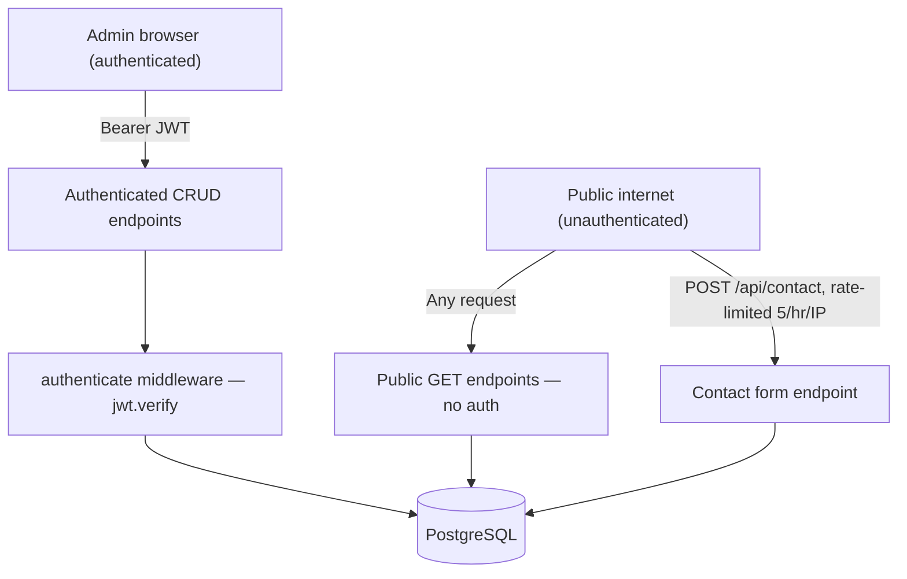

# Security Architecture

## Scope
Security posture at the system-boundary level. Concrete practices, checklists, and the OWASP mapping live in [`../security/`](../security/) — this doc is the architectural picture.

## Trust boundaries

## Where the real boundary is (and isn't)

- **The database is the actual trust boundary for content mutation** — every write path (`POST`/`PUT`/`PATCH`/`DELETE` on any resource) is gated by the `authenticate` middleware verifying a JWT, independent of whether the frontend's client-side route guard is bypassed. This is why the client-side-only `/admin/*` guard (see [`authentication-flow.md`](./authentication-flow.md)) is a real but *secondary* concern — an attacker who bypasses it still can't mutate data without a valid token.
- **The login endpoint is the weakest point in this boundary** — `POST /api/auth/login` has no rate limiting, unlike `/api/contact`. Combined with a single-admin-account model, this is a brute-force surface. See [`../appendices/technical-debt-register.md`](../appendices/technical-debt-register.md) item #12 and [`../security/rate-limiting.md`](../security/rate-limiting.md).
- **Secrets boundary**: `JWT_SECRET`, `DATABASE_URL`/`DIRECT_URL`, and `RESEND_API_KEY` are backend-only env vars, never exposed to the frontend bundle (only `NEXT_PUBLIC_API_URL` is public, by design of the `NEXT_PUBLIC_` prefix convention). See [`../security/secrets-management.md`](../security/secrets-management.md) for the local-`.env`-credential-exposure incident found during the 2026-07 audit.
- **CORS is an allowlist** (`FRONTEND_URL`, comma-separated), not a wildcard — appropriately restrictive, with `credentials: true` enabled ahead of a possible future cookie-based auth migration (see [`future-architecture.md`](./future-architecture.md)).

## Related
- [`../security/`](../security/) — full detail, checklists, OWASP mapping
- [`authentication-flow.md`](./authentication-flow.md)
- [`future-architecture.md`](./future-architecture.md)
