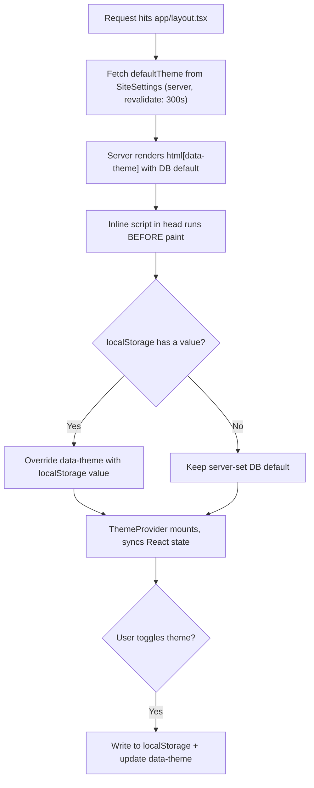
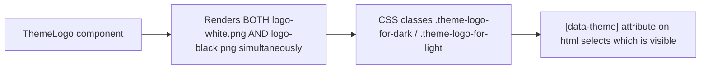

# Theme Architecture

## Scope
Dark/light theme resolution, FOUC prevention, and the theme-aware logo system.

## Resolution flow

**Priority order (highest to lowest):** `localStorage` > `SiteSettings.defaultTheme` (DB, server-rendered) > `:root` CSS default (dark).

## Why the inline script exists

Without it, the server would render the DB default theme, React would hydrate, and *then* `ThemeProvider` would notice `localStorage` disagrees and flip the theme — causing a visible flash (FOUC). The inline `<script>` in `layout.tsx`'s `<head>` runs synchronously before first paint and applies the `localStorage` value directly to the DOM, so the correct theme is present from the very first frame.

## Theme-aware logo system

Both logo variants are always in the DOM; only CSS visibility is toggled based on `[data-theme]`. This avoids a flash/mismatch that would occur if the logo were chosen conditionally in JS after mount (a common source of hydration flicker). Implemented in `ThemeLogo.tsx` + `globals.css` (`.theme-logo-for-dark`/`.theme-logo-for-light`, added in commit `b6aaea5`).

## Related
- [`../design-system/tokens-and-guidelines.md`](../design-system/tokens-and-guidelines.md) — the CSS variables themselves
- [`state-management.md`](./state-management.md)
- [`../components/shared/ThemeLogo.md`](../components/shared/ThemeLogo.md)
