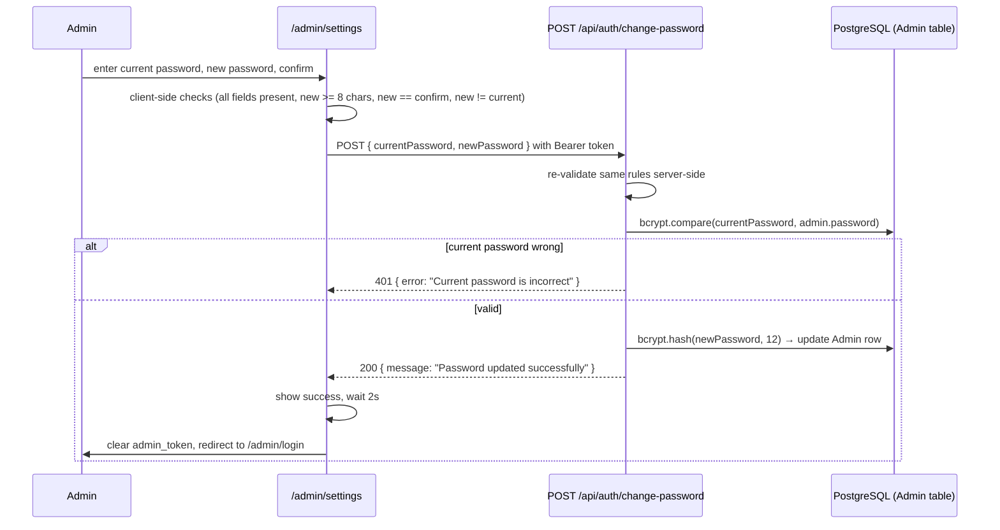

# Feature: Admin Password Management

## Purpose
Lets the logged-in admin change their own password from `/admin/settings`, without needing direct database access or a re-run of the seed script.

## Business Value
Directly addresses [technical debt item #17](../appendices/technical-debt-register.md) (default seeded credentials documented in plaintext) — gives the admin a supported way to rotate the password immediately after first login, which the docs already instruct them to do.

## User Flow

## Architecture
Single backend endpoint (`POST /api/auth/change-password` in `backend/src/routes/auth.ts`), gated by the standard `authenticate` middleware (so the request itself proves identity via the existing JWT — no separate re-auth step). Frontend UI lives inside `frontend/src/app/admin/settings/page.tsx`, as one of several sections on that page (alongside site settings, hero config) — this is not a standalone route.

## Dependencies
`bcryptjs` (backend, cost factor 12, same as initial account creation).

## Components
No dedicated component — the password-change form is inline JSX inside `AdminSettings` (`frontend/src/app/admin/settings/page.tsx`), using [`FormField`/`inputCss`](../components/admin/Modal.md) for consistent styling with the rest of the admin panel.

## Files

| File | Role |
|---|---|
| `backend/src/routes/auth.ts` | `POST /change-password` route handler |
| `frontend/src/app/admin/settings/page.tsx` | Password-change form UI and client-side validation |

## Edge Cases
- **Wrong current password:** backend returns `401`. The frontend's error handling checks `msg.includes('401')` on the caught `Error` (since [`api.ts`](../utilities/api-client.md) only throws a generic `"API error: ${status}"` string, not the backend's actual JSON error body) and maps that to a friendlier `"Current password is incorrect"` message — a brittle but functional pattern given the API client's current limitation.
- **New password same as current:** rejected both client-side and server-side with the same message.
- **New password too short:** rejected both client-side (`< 8` check before submit) and server-side (defense in depth, since the client check could be bypassed).
- **Successful change:** the admin is auto-logged-out 2 seconds after seeing the success message, and must log in again with the new password — this is deliberate (the old JWT remains technically valid until its 7-day expiry regardless, since there's no token-revocation mechanism, but forcing a fresh login is good practice after a credential change).

## Limitations
- Changing the password does not invalidate the admin's *other* existing JWTs (if any existed from other sessions/devices) — there is no server-side token revocation list; old tokens remain valid until their independent 7-day expiry. In practice this rarely matters since there's only one admin account and typically one active session.
- No password strength meter or complexity requirements beyond the 8-character minimum length.
- No "forgot password" flow — if the admin loses the password entirely, recovery requires direct database access or re-running the seed script (which will fail if an admin already exists, since `POST /auth/setup` only works when the `Admin` table is empty).

## Future Enhancements
None tracked as a numbered roadmap item.

## Testing Strategy
Manual only.
