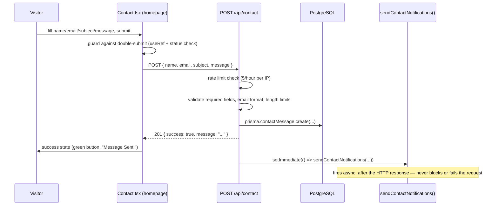

# Feature: Contact Form

## Purpose
Lets a public visitor send a message to the site owner without needing email client integration, storing it in the database and triggering an email notification.

## Business Value
The primary conversion path for recruiters/collaborators — the whole point of a portfolio site is to be contactable.

## User Flow

## Architecture
Frontend: [`Contact`](../components/sections/Contact.md) component, homepage-only, `id="contact"` anchor target linked from [`Navbar`](../components/shared/Navbar.md)/[`Footer`](../components/shared/Footer.md). Backend: `backend/src/routes/contact.ts` handles validation, persistence, and rate limiting; delegates actual email sending to `backend/src/lib/notifications.ts` (see [`../features/notification-system.md`](./notification-system.md) and [`../utilities/backend-notifications-lib.md`](../utilities/backend-notifications-lib.md)).

## Dependencies
`express-rate-limit` (backend), `resend` (backend, via `notifications.ts`), no frontend form library — this form uses plain controlled `useState`, not React Hook Form + Zod despite those being project dependencies used elsewhere.

## Components
- [`Contact`](../components/sections/Contact.md) — the only UI for this feature; no admin-side "compose" counterpart, only [`admin/messages`](../pages/admin-crud-pages.md) for reading submitted messages.

## Files

| File | Role |
|---|---|
| `frontend/src/components/sections/Contact.tsx` | Form UI, submission, status feedback |
| `backend/src/routes/contact.ts` | Validation, rate limiting, persistence, notification dispatch |
| `backend/src/lib/notifications.ts` | Email sending (see [`notification-system.md`](./notification-system.md)) |
| `frontend/src/app/admin/messages/page.tsx` | Admin inbox — read/mark-read/delete |

## Edge Cases
- **Rate limited:** `express-rate-limit` allows 5 submissions per hour per IP; the 6th returns `429` with `{ error: "Too many messages sent. Please try again in an hour." }`. The frontend surfaces this via its generic error-message extraction (`err.message`), so the visitor does see the real backend message here (unlike some admin-side error handling that only sees a generic status-code string).
- **Invalid email format:** backend regex-validates (`/^[^\s@]+@[^\s@]+\.[^\s@]+$/`); no client-side format validation beyond the HTML5 `type="email"` input's native browser check.
- **Field length limits:** name ≤ 100 chars, subject ≤ 200 chars, message ≤ 5000 chars, enforced server-side only (no client-side character counter shown to the visitor, unlike admin Markdown fields which do show counts).
- **Double-click / rapid resubmit:** guarded client-side via a `useRef` flag checked before `status === 'loading'` even updates — prevents a race where two submissions fire before React re-renders the disabled button state.
- **Email notification failure:** does not affect the visitor's experience at all — `sendContactNotifications()` runs in `setImmediate()` after the `201` response is already sent, and its own internal errors are caught and logged, never surfaced back to the HTTP response. A visitor always sees "Message Sent!" if the database write succeeded, regardless of whether the admin email actually sent.

## Limitations
- No CAPTCHA/bot-mitigation beyond the rate limiter — a determined spammer distributing requests across IPs isn't blocked by anything in this feature.
- No admin-facing confirmation that a message was received in real time beyond the eventual (possibly failed) email notification — the admin must check `/admin/messages` to be certain.
- No file/attachment support — plain text fields only.

## Future Enhancements
None tracked as a numbered roadmap item specific to this feature; see [`../architecture/future-architecture.md`](../architecture/future-architecture.md) for broader plans.

## Testing Strategy
Manual only — no automated tests exist for this or any other feature in the codebase (see [`../development/setup-and-workflow.md`](../development/setup-and-workflow.md) for the project's overall testing posture).
