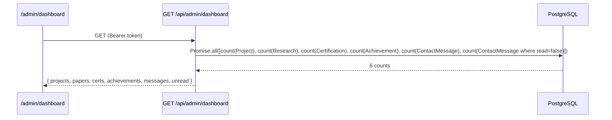

# Feature: Dashboard Analytics

## Purpose
Gives the admin an at-a-glance count of content volume (projects, research papers, certifications, achievements) and contact-message inbox status (total, unread) on login, without opening every section individually.

## Business Value
Quick orientation for the site owner — "how much content do I have, are there unread messages" — without being a full analytics/traffic dashboard (there is no visitor analytics anywhere in this project; see [`../appendices/audit-report.md`](../appendices/audit-report.md) item 22, "None integrated — no Vercel Analytics, GA, or any analytics package found").

## User Flow
1. Admin logs in, lands on `/admin/dashboard`.
2. Page fetches `GET /api/admin/dashboard` with the JWT.
3. Six count cards render (Projects, Research Papers, Certifications, Achievements, Messages, Unread Messages), each linking to its respective admin section.
4. A "Quick Actions" row offers direct create-shortcuts (`+ New Project`, etc.) and a "View Portfolio" link that opens the public site in a new tab.

## Architecture

This is the entirety of "analytics" in this project — six `prisma.count()` aggregates, no time-series data, no charts, no visitor/traffic metrics of any kind.

## Dependencies
None beyond Prisma's built-in `count()` aggregate query.

## Components
No dedicated component — the dashboard page (`frontend/src/app/admin/dashboard/page.tsx`) renders its stat cards and quick-action links inline; see [`../pages/admin-dashboard.md`](../pages/admin-dashboard.md).

## Files

| File | Role |
|---|---|
| `backend/src/routes/dashboard.ts` | The aggregate-count endpoint, mounted at `/api/admin/dashboard` (see note below) |
| `frontend/src/app/admin/dashboard/page.tsx` | Renders the counts and quick-action links |

**Endpoint mount path note:** `backend/src/index.ts` mounts this router at `app.use('/api/admin/dashboard', dashboardRoutes)` — i.e. the actual path is `/api/admin/dashboard`, not `/api/dashboard`. [`../api/rest-api-reference.md`](../api/rest-api-reference.md) does not currently list this endpoint at all; that's a documentation gap worth fixing in that file directly, flagged here rather than silently worked around.

## Edge Cases
- **Aggregation query failure:** `backend/src/routes/dashboard.ts` catches any error from the `Promise.all` and returns an all-zero count object with a `200` status rather than propagating an error — so a database hiccup silently shows "0" across every card instead of an error state. The frontend's own `.catch(console.error)` only logs to the console; nothing in the UI indicates the counts might be wrong rather than genuinely zero.

## Limitations
- No historical/trend data — a single point-in-time snapshot on every dashboard load, not a time-series.
- No visitor/traffic analytics of any kind (page views, referrers, etc.) — "dashboard analytics" in this codebase means content counts only.
- Silent failure mode (see Edge Cases) means a genuine outage and a genuinely-empty database are visually indistinguishable to the admin.

## Future Enhancements
Distinguishing "failed to load" from "genuinely zero" in the dashboard UI would be a reasonable small fix; not currently tracked as a numbered debt item.

## Testing Strategy
Manual only.
