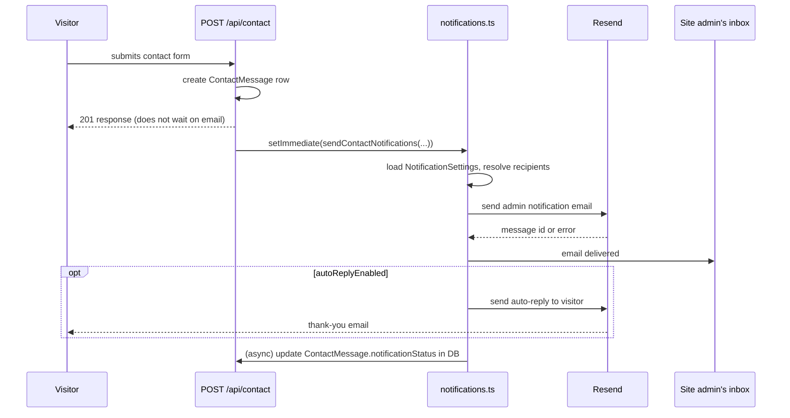

# Feature: Notification System (Resend Email)

## Purpose
Notifies the site admin by email whenever a visitor submits the contact form, with an optional auto-reply back to the visitor. Replaced an earlier WhatsApp (Twilio) + SMTP (Nodemailer) system entirely.

> This doc is a feature-level summary. For the full historical migration detail (schema changes, removed dependencies, verification checklist from the original PR), see [`../releases/2026-notification-system-migration.md`](../releases/2026-notification-system-migration.md) — that doc is the canonical record; this one is not a duplicate.

## Business Value
Ensures the site owner actually sees contact-form submissions promptly (email is a more reliable/immediate channel than periodically checking `/admin/messages`), and gives visitors reassurance via an optional auto-reply.

## User Flow

## Architecture
Entirely backend-driven — `backend/src/lib/notifications.ts` owns all email logic (templates, sending, status tracking); `backend/src/routes/notificationSettings.ts` exposes the admin-configurable settings CRUD; `backend/src/routes/contact.ts` triggers the send. The frontend admin UI at `/admin/notifications` is purely a settings editor — it never sends an email directly except via the "Send Test Email" button, which calls `POST /notification-settings/test`.

## Dependencies
`resend` (npm package, backend only). No frontend dependency — the admin UI is a plain form.

## Components
- `frontend/src/app/admin/notifications/page.tsx` — the settings UI (see [`../pages/admin-crud-pages.md`](../pages/admin-crud-pages.md) for the shared admin-page pattern this follows: load/save/toast, inline styles).

## Files

| File | Role |
|---|---|
| `backend/src/lib/notifications.ts` | Email templates, `sendContactNotifications()`, `sendTestEmail()` — see [`../utilities/backend-notifications-lib.md`](../utilities/backend-notifications-lib.md) |
| `backend/src/routes/notificationSettings.ts` | `GET`/`PUT /notification-settings`, `POST /notification-settings/test` |
| `backend/src/routes/contact.ts` | Triggers the send after message creation |
| `frontend/src/app/admin/notifications/page.tsx` | Admin settings form |

## Edge Cases
- **No `RESEND_API_KEY` configured:** the send is skipped entirely (`notificationStatus: 'no_api_key'`), logged as a warning, not an error — the contact form still succeeds for the visitor.
- **No recipients configured:** `notificationStatus: 'no_recipients'`, same non-fatal handling.
- **Auto-reply failure:** caught independently of the admin notification's success/failure — a failed auto-reply never changes the overall `notificationStatus`, which reflects only the admin-facing send.
- **Every outcome is persisted** back onto the originating `ContactMessage` row (`emailSent`, `emailSentAt`, `resendMessageId`, `notificationStatus`, `adminNotified`) — so admins can audit delivery status per message even without checking their inbox, via `/admin/messages`.

## Limitations
- HTML escaping for email bodies is a manual `escapeHtml()` function (fixed `&<>"'` replacements), not a dedicated sanitization library — sufficient for this specific use (plain-text form fields embedded in a fixed HTML template), but not a general-purpose HTML sanitizer.
- No retry/backoff on Resend send failures — a failed send is logged and recorded as failed; there's no queued retry.
- No delivery-status webhook integration from Resend (e.g. bounce/open tracking) — `resendMessageId` is stored but never queried against Resend's API afterward.

## Future Enhancements
None tracked as a numbered roadmap item beyond what's already in [`../releases/2026-notification-system-migration.md`](../releases/2026-notification-system-migration.md)'s "Verification" checklist (already completed at time of merge).

## Testing Strategy
Manual only. The admin panel's "Send Test Email" button (`POST /notification-settings/test`) is the closest thing to a built-in test harness — it exercises the same `buildAdminEmailHtml()` template with synthetic data.
