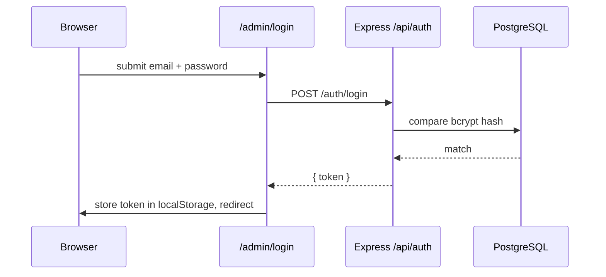

# Markdown, Image, and Diagram Standards

## Markdown standard

- GitHub-Flavored Markdown (GFM). Tables, task lists, and fenced code blocks with language tags are expected, not optional.
- One H1 per file, matching the file's purpose. Use `##`/`###` for sections/subsections — don't skip heading levels.
- Always tag code fences with a language (` ```ts `, ` ```bash `, ` ```json `) — untagged fences don't get syntax highlighting and are a paper cut for readers.
- Line length: no hard wrap requirement, but keep individual sentences readable — don't write 400-character single-line paragraphs.
- Use `>` blockquotes for callouts (warnings, known drift, "not yet built" notices) — this project uses `>` consistently for anything the reader should not skim past.
- Relative links only for repo-internal references: `[architecture overview](../architecture/overview.md)`, never a hardcoded `https://github.com/...` link to your own repo's files.

## Image guidelines

- Store diagram/screenshot source assets under [`assets/`](../assets/) or [`diagrams/`](../diagrams/) as appropriate — never inline base64 images in Markdown.
- Every image needs descriptive alt text: ``, not ``.
- Prefer SVG for diagrams (scales cleanly), PNG for real screenshots.
- If a screenshot documents UI, note the date it was taken in the surrounding text — UI screenshots go stale silently and a dated one is honest about that.

## Diagram standards

- **Mermaid is the default** for any structural/flow diagram (architecture, data flow, auth flow, entity relationships) — it's plain text, diffs cleanly in git, and doesn't need an external tool to edit. See the Mermaid section below for the specific conventions used in this project.
- Reserve actual image-based diagrams (Figma exports, hand-drawn) for cases Mermaid genuinely can't express well (detailed UI mockups) — and even then, store the source file, not just a flattened export.
- Every diagram needs one sentence of prose immediately before or after it explaining what it shows — never let a diagram stand alone as the only explanation.

## Mermaid standards

- Fence with ` ```mermaid ` so it renders on GitHub and in most Markdown viewers.
- Diagram type conventions used across this doc set:
  - `flowchart TD` (top-down) for request/data flow and process sequences.
  - `sequenceDiagram` for anything involving multiple actors exchanging messages over time (e.g., auth flow: browser ↔ Express ↔ JWT).
  - `erDiagram` for the database schema relationships.
  - `graph TD` for folder/component hierarchy trees where flow direction doesn't matter as much as containment.
- Keep node labels short (2-5 words); put detail in the surrounding prose, not crammed into the diagram.
- Name nodes with meaningful IDs (`ExpressAPI`, not `A`) — makes the Mermaid source itself readable as a diff, not just the rendered output.
- One diagram = one concept. If you need "and also," that's a second diagram.

### Example



See [`architecture/authentication-flow.md`](../architecture/authentication-flow.md) and [`diagrams/`](../diagrams/) for the full set used across this project.
