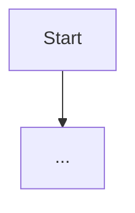

# Architecture: `<Topic>`

## Scope
<!-- One sentence: what this document covers and what it deliberately excludes. -->

## Current State

<!-- Prose + Mermaid diagram (see docs/standards/markdown-and-diagram-standard.md) -->

## Why It's Built This Way
<!-- Link the relevant ADR if one exists: docs/adr/000X-....md -->

## Known Limitations / Debt
<!-- Link docs/appendices/technical-debt-register.md items rather than duplicating them. -->

## Related Docs
<!-- Cross-links. -->
